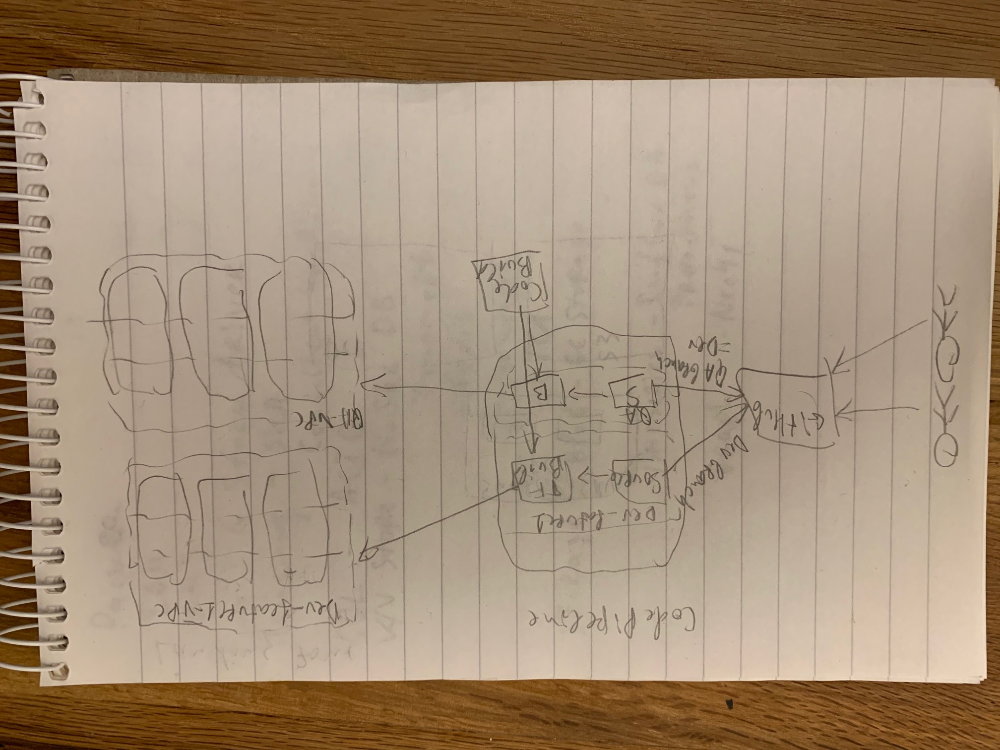

# terraform-eks-pipeline


## Description

This is a sample Terraform code to deploy AWS Elastic Kubernetes Service cluster and Worker nodes using AWS CodePipeline

## High-level Diagram



## Installation

**Every installation will provision AWS Elastic Kubernetes Service cluster and Kubernetes Working nodes so additional AWS charges will apply**

(Terraform version 0.12 would be working if -chdir flag is not used. If -chdir flag is used as in the example below, then Terraform version 0.14 is required.)

Clone the repository

```shell
git clone https://github.com/iv-st-me/terraform-eks-pipeline.git
```

```shell
cd terraform-eks-pipeline
```

Change the configuration files (example for dev environment):
environments/aws/network/dev.tfvars
environments/aws/eks/dev.tfvars
environments/aws/pipeline/dev.tfvars

```shell
terraform -chdir=services/aws/1-bootstrap init
```
```shell
terraform -chdir=services/aws/1-bootstrap apply
```

You will need to provide a region, for example eu-central-1

```shell
terraform -chdir=services/aws/2-codepipeline init -backend-config=backend.config
```
```shell
terraform -chdir=services/aws/2-codepipeline workspace new dev
```
```shell
terraform -chdir=services/aws/2-codepipeline apply -var-file=../../../environments/aws/pipeline/dev.tfvars
```

That's it!

**Please note that it will install new CodePipeline and will kick in automatically Deployment of:**
- VPC
- Networking: 3 Availability zones, 3 Networks, NAT GWs, Security Groups, Routing Tables, EIPs
- EKS: Based on the configuration it will install Kubernetes cluster with multiple Worker nodes as per configuration

The deployment is based in the configuration files:
environments/aws/network/dev.tfvars (or qa.tfvars, or ...)
environments/aws/eks/dev.tfvars (or qa.tfvars, or ...)

## Implementation

The Terraform implementation is structured in three main concepts: Environments, Modules and Services

Environment is a configuration definition of multiple services and their environments. The current structure is service/environment but it can be environment/service. It is only a logical folder structure and is used by terraform by adding "-var-file=../../../environments/aws/[service]/[environment].tfvars"

Module is a group of resources related to the setup environment. Each Module:
- installs different Terraform resource
- abstracts complexity
- does one task
- not executed by Terraform commands but called from a Service

Service is a collection of logically connected Modules. Each Service is:

- global or region specific
- it can use one or multiple Modules or additional resources

## State files

Solution utilises shared Terraform state stored in AWS S3, and shared state locking stored in Dynamo DB.

Configuration is happening during init process and the config is in file backend.config with sample content:
```shell
bucket               = "terraform-eks-pipeline"
encrypt              = true
key                  = "vpcnet/tf-state.json"
region               = "eu-central-1"
workspace_key_prefix = "environment"
dynamodb_table       = "terraform_state_lock"
```

Working with different Environments and saving/sharing their state is done with using Terraform Workspace:
```shell
terraform workspace new prod
```
that will create **prod** environment and will create new folder structure in the S3 bucket. Using upper backend.config example it will be: environment/prod/vpcnet/tf-state.json

During Terraform updates DynamoDB state locking will be used using the table from the same configuration file.

## Pipeline

Solution utilises AWS CodePipeline service with 2 stages that can be extended as per need:
* Get Source
* Invoke Terraform Build

After Pipeline is deployed it starts to monitor the used GitHub branch and if there is new commit to the branch, it automatically kicks in new deployment. So any change in the configuration will be automatically reflected in the deployment.
After Pipeline is deployed there is near zero or zero maintenance, as all the settings and features are in the code repository. After new feature or configuration is added, it is automatically deployed by the Pipeline.

Additional stages like Test and Approval can be easily added by extending the Pipeline module.

## Branch strategy

For great flexibility, using different GitHub code repository branches are in the configuration files. So that, each environment can be attached to specific GitHub repository branch.


## Different code in different environments with different configurations

Great flexibility is achieved with combining different configurations for different environments and different features set:

1. Different code that is in different branch could be deployed in every deployment
2. Every selected code branch from point 1 could be deployed in different Environment
3. Every specified feature-set configuration (from configuration files) could be deployed in any combination from point 1 and point 2

## Production ready?

This is a sample implementation and is for testing purposes. In order to make it ready for Production multiple things must be added:

* Account strategy - Landing zones. Domain Controller of Identity federation with Account grouping. Restricting access of accounts for example normal account should not be able to create IGW/NATGW resources

* Networking - Transit Gateway as central connectivity and traffic engineering point. Possible utilisation of Transit VPC with Application Firewall. Default GW is only via Transit GW/Transit VPC - all Ingress/Egress is engineered and controlled in the Transit VPC

* Security - Security configurations must be in a code repository with CI/CD. All VPC, instances and Application logs should be collected in a separate SIEM VPC with log archiving.

* Jenkins Pipeline, AWS CodePipeline or GitLab for CD/CI/CD/CS
